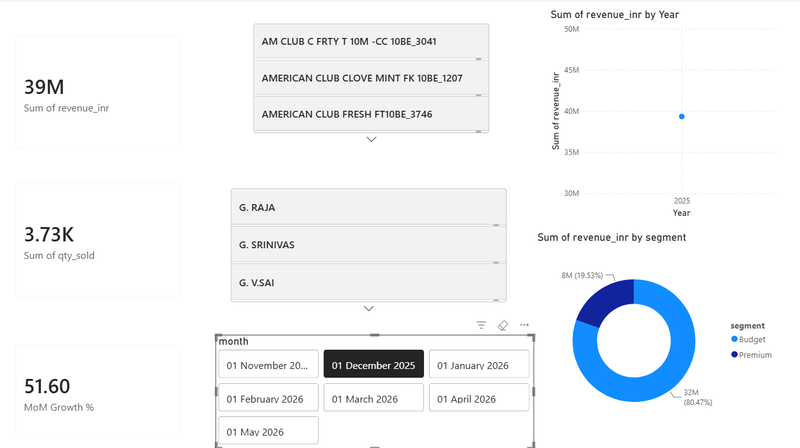
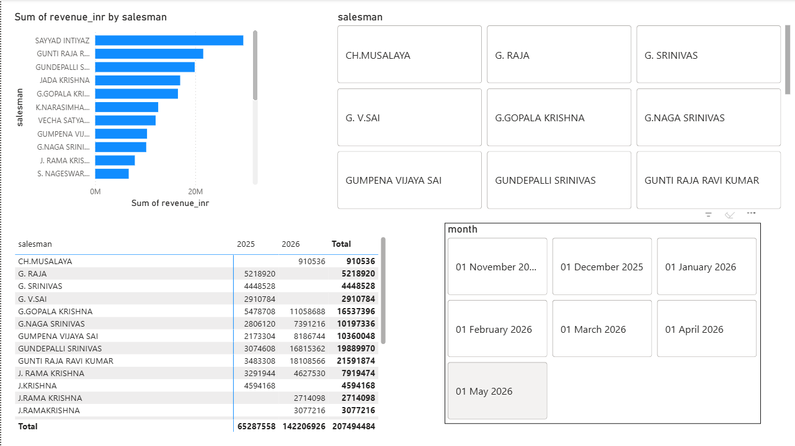
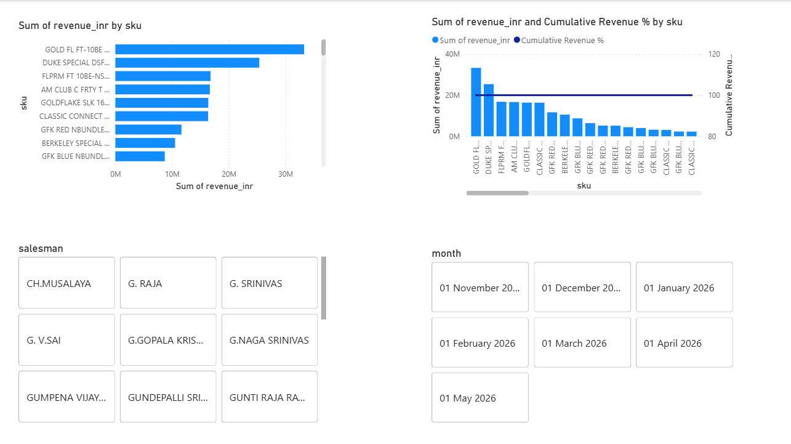

# ITC FMCG Distribution Sales Analysis

## Project Overview
Analyzed 7 months of real distributor sales data from an ITC cigarette 
channel partner handling ₹20.75 Cr in revenue across 67 SKUs and 12 salesmen.

## Tools Used
- **Excel** — raw data received, initial exploration
- **Python** — data cleaning and flattening pivot tables into analysis-ready format
- **SQL** — 16 queries for trend analysis, Pareto, salesman ranking
- **Power BI** — 3-page interactive dashboard

## Dataset
- 7 months: Nov 2025 – May 2026
- 2,116 rows after flattening
- 67 unique SKUs | 24 salesmen | ₹20.75 Cr total revenue

## Key Findings
- **80/20 rule confirmed** — top 10 SKUs (15% of catalogue) drive 80% of revenue
- **Peak month** — Dec 2025 at ₹393L, 52% higher than Nov 2025
- **Top salesman** — Sayyad Intiyaz led in 4 of 7 months with the lowest volatility
- **Budget SKUs dominate** — 82.6% of revenue comes from MRP ≤ ₹200 packs
- **Feb–Apr trough** — 3 consecutive months flat at ~₹250L, possible seasonal pattern

## Dashboard Preview

## Files
| File | Description |
|------|-------------|
| `itc_sales_flat.csv` | Cleaned flat data ready for SQL/Power BI |
| `itc_sales_queries.sql` | 16 SQL queries covering all analyses |
| `dashboard_overview.png` | Power BI Page 1 — Overview |
| `dashboard_salesman.png` | Power BI Page 2 — Salesman Performance |
| `dashboard_sku.png` | Power BI Page 3 — SKU Analysis |

## Live Dashboard
[View on Power BI Service](YOUR_POWERBI_LINK_HERE)
